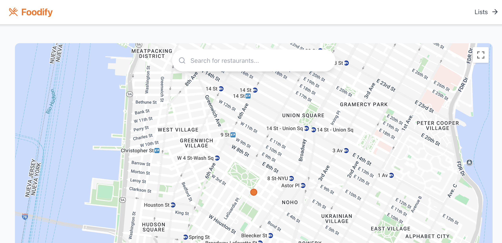
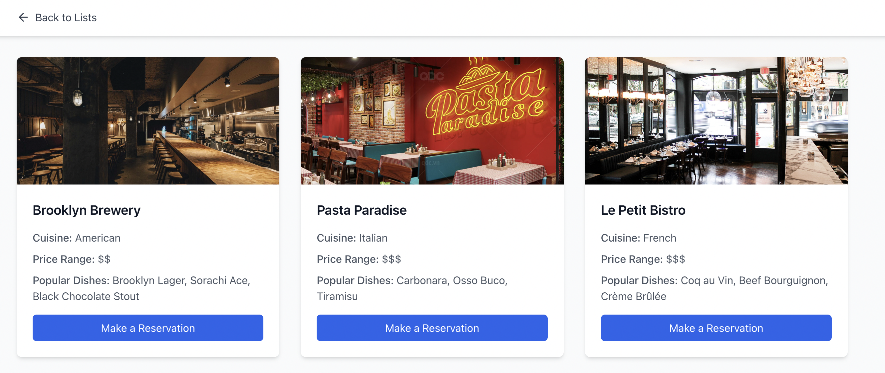

# Data Product Frontend - Foodify



## Project Description

This project is the frontend prototype for our data product, **Foodify**, allowing users to explore restaurant collections, navigate lists, and view maps of restaurants. The primary goal is to implement a user-friendly, responsive interface using React, based on wireframes we created in Figma.

## Figma Wireframe

The initial wireframe in Figma guided the layout and component structure for this project. It includes a basic flow between primary components, user interactions, and a focus on component placement. The wireframe link or exported file can be found [here](https://www.figma.com/design/9TSA9lHTsOBFWM9XFOGB6k/Foodify-Wireframe?node-id=0-1&m=dev&t=zLGmbL571CAWqaCm-1).

## Component Documentation

### App.js

`App.js` is the main entry point for the application, setting up routing for different pages using `react-router-dom`. Key routes include pages for registration, login, restaurant lists, maps, and individual restaurant details. `App.js` integrates several components and provides navigation throughout the app.

### Login.js

The `Login` component presents a login form where users can enter their credentials or sign in using social login options. This component features a split-screen layout with the form on the right and a placeholder image area on the left. Upon submission, users are navigated to the map view.

### Register.js

The `Register` component provides a registration form where users can sign up with their email, username, and password. Similar to `Login.js`, this component includes a split-screen layout and social login buttons. Upon form submission, users are navigated to the login page.

### ListCard.js

The `ListCard` component displays individual list items on the `ListsPage`. Each card includes an image placeholder, a header, and a description. The image, header and description will be fetched out from Playlists database according to the PlaylistID key. `ListCard` is a clickable component, which navigates to the individual page for the restaurants list.

### ListsPage.js

The `ListsPage` component renders a collection of `ListCard` components in two sections: Popular Lists and Your Lists. Selection for Popular Lists will be inserted manually, while Your Lists section is determined according to user's username and playlists in the database.

### IndivRestaurantCard.js

The `IndivRestaurantCard` component displays detailed information about a specific restaurant. It retrieves the restaurantId from the URL and searches for the corresponding restaurant in sampleRestaurantData (temporary). It shows the restaurant’s name, cuisine type, location, description, rating, popular dishes, and price range. Additionally, it includes an image of the restaurant and a "Make a Reservation" button linking to OpenTable.

### IndivPlaylist.js

The `IndivPlaylist` is a component that displays a list of restaurants. Each restaurant is displayed as a card with its image, name, cuisine type, price range, and popular dishes. The restaurant name is a clickable link that navigates to the individual restaurant's detail page

## Setup Instructions

Warning:
Currently, the setup requires running back-end and front-end separately.

1. **Clone the Repository**:

   ```
   git clone https://github.com/ffang0224/foodify-app
   cd foodify-app
   ```

2. **Install Dependencies**:

   ```
   npm install
   ```

   Run the above to install all necessary packages.

3. **Run the Backend Server** (in a separate terminal):

- Clone the backend repository if you haven't already:

  ```unix
  git clone https://github.com/ffang0224/ppds-team-5.git
  ```

- Navigate to the backend project directory:

  ```
  cd ppds-team-5
  ```

- Create a virtual environment and activate it:

  ```python
  python -m venv .venv

  # On Windows:
  .venv\Scripts\activate

  # On macOS and Linux:
  source .venv/bin/activate
  ```

- Install backend dependencies:
  ```
  pip install -r requirements.txt
  ```
- Create firebase_credentials.json and write the data:

  ```console
  cd python_script
  touch firebase_credentials.json

  * Write credentials on your file *

  cd ..
  ```

- Start the backend server:
  ```
  cd api/
  uvicorn app:app
  ```
- Keep this terminal open to keep the backend server running.

4. **Run the Frontend Application** (in another terminal):
   ```
   npm start
   ```

## Dependencies

- `react-router-dom` for navigation between pages.
- `@react-google-maps/api` for map integration.
- `lucide-react` for icon support.

## Environment Variables

For Google Maps, Firebase credentials or other API keys, create a `.env` file at the root level in frontend folder and add any necessary keys in the format:

```
REACT_APP_GOOGLE_API_KEY=...
REACT_APP_FIREBASE_API_KEY=...
REACT_APP_FIREBASE_AUTH_DOMAIN=...
REACT_APP_FIREBASE_PROJECT_ID=...
REACT_APP_FIREBASE_STORAGE_BUCKET=...
REACT_APP_FIREBASE_MESSAGING_SENDER_ID=...
REACT_APP_FIREBASE_APP_ID=...
```

See `.env.example` for reference.

## Development Process

The development process was focused on laying down the bases for a component-focused system. We ensured that no component became too complex, taking up too much functionality of the app. For example, we have `ListsPage.js`, which renders `ListCard.js`, a custom card component that becomes part of the bigger element (the `List` page itself)

### Design Decisions

In terms of design decisions, we abided by common practices, using popular libraries and resources:

- **Consistent Visual Layout**: We aimed for a clean, minimalistic interface, keeping components well-spaced to maintain focus on content.
- **User-Friendly Navigation**: We implemented a straightforward navigation flow with prominent buttons and clear sections, allowing users to easily switch between different pages.
- **Social Login Integration**: Social login buttons for Google and Facebook were added to streamline the login experience and encourage quick access.



### Technical Choices

- **Tailwind CSS**: Tailwind CSS was selected for its utility-first approach, enabling us to rapidly style components without creating separate CSS files.

- **Google Maps API**: We included @react-google-maps/api in preparation for map integration within the app, providing location-based restaurant data.

- **Icon Library**: We opted for lucide-react to provide a versatile and lightweight icon set, allowing us to develop the app’s UI with minimal setup and ensuring our icons fit properly within the design.

## AI Usage

AI was used to assist with the initial structuring and formatting of components, particularly in ensuring consistent styles and layout across files. It provided guidance on component organization, helped troubleshoot minor issues, and offered examples for setting up Tailwind CSS classes. With the help of the AI, our team handled the detailed component development, functionality, and UI logic to align with our specific requirements.
